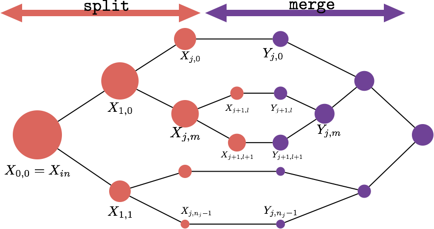
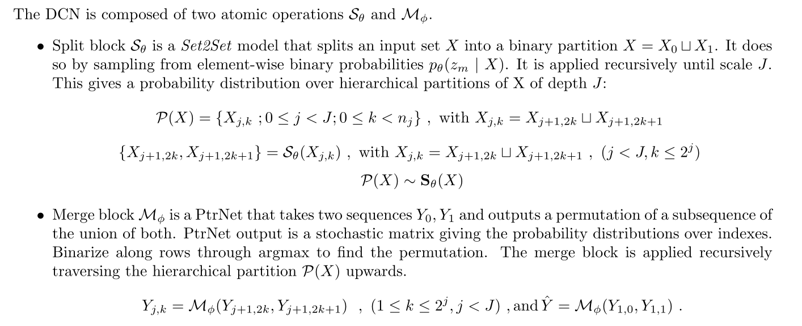
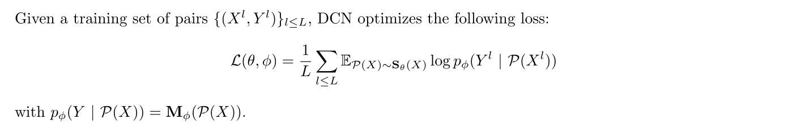
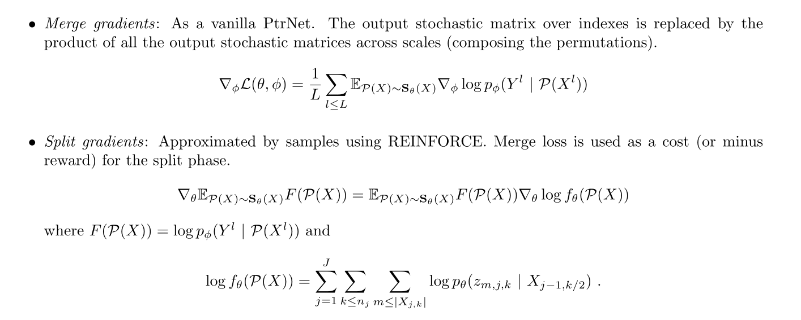

# Divide and Conquer Networks (DCN)


Code accompanying [Divide and Conquer Networks](https://arxiv.org/pdf/1611.02401.pdf)
# DCN Summary
## Model



## Weak supervision Loss



## Gradients computation



# Reproduce Experiments
## Prerequisites

- Computer with Linux or OSX
- [PyTorch](http://pytorch.org)
- For training, an NVIDIA GPU is needed. CPU not supported.
## Comments
- For information about input arguments check main script.
- For changing datasets default configuration modify the corresponding data_generator __init__
## Sorting
### Baseline
```
python code/Sorting/main.py --path [experiment folder] --path_dataset [dataset folder]
```
### Mergesort (Fix Split)
```
python code/Sorting/main.py --path [experiment folder] --path_dataset [dataset folder] --dynamic --mergesort_split
```
### Quicksort (Fix Merge)
```
python code/Sorting/main.py --path [experiment folder] --path_dataset [dataset folder] --dynamic --quicksort_merge
```
### Joint Training
```
python code/Sorting/main.py --path [experiment folder] --path_dataset [dataset folder] --dynamic
```

## Convex Hull
### Baseline
```
python code/ConvexHull2d/main.py --path [experiment folder] --path_dataset [dataset folder]
```
### Without split computational regularization
```
python code/ConvexHull2d/main.py --path [experiment folder] --path_dataset [dataset folder] --dynamic
```
### Add split computational regularization
```
python code/ConvexHull2d/main.py --path [experiment folder] --path_dataset [dataset folder] --dynamic --regularize_split
```

## K-means

```
python code/K-means/main.py --path [experiment folder] --path_dataset [dataset folder] --num_clusters [number of clusters]
```

